# TÀI LIỆU BIỂU ĐỒ LỚP CHI TIẾT TOÀN HỆ THỐNG (DETAILED SYSTEM CLASS DIAGRAM - BCE PATTERN)

Tài liệu này chứa biểu đồ lớp mức thiết kế chi tiết cho toàn bộ dự án **PheLaWeb** theo mô hình **Boundary - Control - Entity (BCE)** kết hợp với mẫu **DAO (Data Access Object)**. Sơ đồ mô tả chi tiết các thành phần giao diện (UI), các lớp điều khiển xử lý nghiệp vụ (Control/Manager), các lớp kết nối cơ sở dữ liệu (DAO/Repository) và các lớp thực thể (Entity) với đầy đủ thuộc tính, kiểu dữ liệu, phương thức và các mối quan hệ (Association, Aggregation, Composition) liên kết giữa chúng.

---

## 1. Bản Đồ Phân Phối Lớp (BCE + DAO Class Mapping)

Hệ thống được chia thành 5 phân hệ chính:
1.  **Phân hệ Thành viên & Tài khoản**: Quản lý đăng nhập, thông tin khách hàng, địa chỉ nhận hàng và lịch sử tích lũy điểm.
2.  **Phân hệ Cửa hàng & Thực đơn**: Xem danh sách chi nhánh, lọc danh mục sản phẩm, xem chi tiết sản phẩm và size đi kèm.
3.  **Phân hệ Giỏ hàng & Đặt hàng**: Quản lý giỏ hàng tạm thời, áp dụng mã giảm giá (Voucher), tính toán tiền ship, tạo hóa đơn đơn hàng và thanh toán.
4.  **Phân hệ Tư vấn AI & Khiếu nại**: Hệ thống chatbot AI tự động tư vấn thực đơn qua Gemini API và tiếp nhận ý kiến khiếu nại từ khách hàng.
5.  **Phân hệ Báo cáo & Dashboard**: Xem bảng điều khiển tóm tắt hoạt động, thống kê doanh thu theo chi nhánh/chu kỳ thời gian và phân tích phân bổ trạng thái đơn hàng/sản phẩm bán ra theo danh mục.

---

## 2. Sơ đồ Lớp Chi tiết Toàn hệ thống (Mermaid Class Diagram)

```mermaid
classDiagram
    %% Stereotypes Definition & Styling
    classDef boundary fill:#e1f5fe,stroke:#0288d1,stroke-width:2px;
    classDef control fill:#e8f5e9,stroke:#388e3c,stroke-width:2px;
    classDef entity fill:#fff3e0,stroke:#f57c00,stroke-width:2px;
    classDef dao fill:#ede7f6,stroke:#5e35b1,stroke-width:2px;
    classDef actor fill:#fce4ec,stroke:#c2185b,stroke-width:2px;

    %% ---------------------------------------------
    %% ACTORS
    %% ---------------------------------------------
    class Customer_Actor {
        <<Actor>>
    }
    class Admin_Actor {
        <<Actor>>
    }

    %% ---------------------------------------------
    %% BOUNDARY CLASSES (Giao diện & API DTOs)
    %% ---------------------------------------------
    class GiaoDienDangNhap {
        <<Boundary / UI>>
        +usernameInput: String
        +passwordInput: String
        +hienThiGiaoDien() void
        +nutDangNhapClick() void
        +nutDangKyClick() void
    }

    class GiaoDienThanhVien {
        <<Boundary / UI>>
        +thongTinThanhVien: Object
        +danhSachDiaChi: List
        +hienThiThongTin() void
        +nutCapNhatProfileClick() void
        +nutThemDiaChiClick() void
    }

    class GiaoDienCuaHang {
        <<Boundary / UI>>
        +danhSachCuaHang: List
        +danhSachSanPham: List
        +danhMucChon: String
        +hienThiMenu() void
        +nutChonCuaHangClick() void
        +nutLocDanhMucClick() void
    }

    class GiaoDienGioHang {
        <<Boundary / UI>>
        +danhSachItem: List
        +tongTienGioHang: double
        +hienThiGioHang() void
        +nutSuaSoLuongClick() void
        +nutXoaItemClick() void
        +nutThanhToanClick() void
    }

    class GiaoDienDatHang {
        <<Boundary / UI>>
        +voucherCodeInput: String
        +phuongThucThanhToan: String
        +diaChiGiaoHang: String
        +phiShip: double
        +hienThiThanhToan() void
        +nutApDungVoucherClick() void
        +nutXacNhanDatHangClick() void
    }

    class GiaoDienKhungChat {
        <<Boundary / UI>>
        +tinNhanNhap: String
        +danhSachTinNhan: List
        +hienThiKhungChat() void
        +nutGuiTinNhanClick() void
    }

    class GiaoDienKhieuNai {
        <<Boundary / UI>>
        +noiDungKhieuNai: String
        +donHangLienQuan: String
        +hienThiForm() void
        +nutGuiKhieuNaiClick() void
    }

    class GiaoDienDashboard {
        <<Boundary / UI>>
        +statsKPIs: Object
        +weeklyRevenueData: List
        +recentOrders: List
        +hienThiDashboard() void
        +nutThaoTacNhanhClick(String action) void
    }

    class GiaoDienBaoCaoDoanhThu {
        <<Boundary / UI>>
        +periodSelected: String
        +branchSelected: String
        +revenueData: List
        +hienThiBaoCao() void
        +locBaoCaoClick(String period, String branch) void
        +nutXuatExcelClick() void
    }

    class GiaoDienBaoCaoDonHang {
        <<Boundary / UI>>
        +summaryOrders: Object
        +statusData: List
        +categoryData: List
        +hienThiBaoCao() void
    }

    %% DTOs
    class OrderCreateRequest {
        <<Boundary / DTO>>
        +customerId: String
        +voucherCode: String
        +addressText: String
        +phone: String
        +shippingFee: double
    }

    class OrderResponse {
        <<Boundary / DTO>>
        +orderId: String
        +orderCode: String
        +finalAmount: double
        +status: String
    }

    %% ---------------------------------------------
    %% CONTROL CLASSES (Lớp điều khiển nghiệp vụ)
    %% ---------------------------------------------
    class DieuKhienHeThong {
        <<Control>>
        +xacThucTaiKhoan(String user, String pass) boolean
        +dangKyThanhVien(String user, String email, String pass) boolean
        +truyVanThongTinThanhVien(String customerId) Customer
        +capNhatThongTinProfile(String id, String name, String phone) void
    }

    class DieuKhienCuaHang {
        <<Control>>
        +layDanhSachCuaHang(String city) List~Branch~
        +layThucDonCuaHang(String branchCode) List~Product~
        +timKiemSanPham(String search) List~Product~
    }

    class DieuKhienGioHang {
        <<Control>>
        +layGioHangKhachHang(String customerId) Cart
        +themSanPhamVaoGio(String customerId, String productId, int qty) Cart
        +capNhatSoLuongGio(String customerId, String itemId, int qty) Cart
        +xoaItemKhoiGio(String customerId, String itemId) Cart
    }

    class DieuKhienDonHang {
        <<Control>>
        +tinhToanGiaTriDon(String cartId, String voucherCode) double
        +taoDonHangMoi(String customerId, String cartId, String voucherCode, String address) Order
        +thanhToanDonHang(String orderId, String method) boolean
        +huyDonHang(String orderId) void
    }

    class DieuKhienTuVan {
        <<Control>>
        +xuLyTinNhanAI(String customerId, String text) String
        +layLichSuHoiThoai(String customerId) List~ConversationMessage~
        +ghiNhanKhieuNai(String customerId, String orderId, String content) Complaint
    }

    class DieuKhienBaoCao {
        <<Control>>
        -OrderDAO orderDAO
        -ProductDAO productDAO
        -CustomerDAO customerDAO
        -BranchDAO branchDAO
        -AdminDAO adminDAO
        +layThongTinDashboard(String token) Object
        +layBaoCaoDoanhThuChiNhanh(String token, String period) List
        +layBaoCaoDonHangAnl(String token) Object
        +xuatFileExcelDoanhThuChiNhanh(String period) byte[]
    }

    %% ---------------------------------------------
    %% DAO CLASSES (Data Access Objects)
    %% ---------------------------------------------
    class CustomerDAO {
        <<Interface / DAO>>
        +save(Customer c) void
        +findById(String id) Customer
        +count() long
    }
    class BranchDAO {
        <<Interface / DAO>>
        +save(Branch b) void
        +findByCode(String code) Branch
        +findAll() List~Branch~
    }
    class ProductDAO {
        <<Interface / DAO>>
        +save(Product p) void
        +findByCategory(String catCode) List~Product~
        +countActiveProducts() long
    }
    class CartDAO {
        <<Interface / DAO>>
        +save(Cart c) void
        +findByCustomerId(String customerId) Cart
    }
    class OrderDAO {
        <<Interface / DAO>>
        +save(Order o) void
        +findById(String id) Order
        +findWeeklyRevenue() List
        +countOrdersToday() long
        +sumRevenueThisMonth() double
        +findBranchRevenue(String period) List
        +countOrdersAndCancelledIn30Days() Object
        +countOrdersByStatus() List
    }
    class ConversationDAO {
        <<Interface / DAO>>
        +save(Conversation conv) void
        +findByCustomerId(String customerId) Conversation
    }
    class ComplaintDAO {
        <<Interface / DAO>>
        +save(Complaint comp) void
        +findById(String id) Complaint
    }
    class AdminDAO {
        <<Interface / DAO>>
        +count() long
    }

    %% ---------------------------------------------
    %% ENTITY CLASSES (Lớp thực thể)
    %% ---------------------------------------------
    class Customer {
        <<Entity>>
        +id: String
        +customerCode: String
        +fullName: String
        +email: String
        +phone: String
        +points: int
        +membershipClass: String
        +created_at: DateTime
    }

    class Address {
        <<Entity>>
        +id: String
        +recipientName: String
        +phone: String
        +detailedAddress: String
        +city: String
        +isDefault: boolean
    }

    class PointHistory {
        <<Entity>>
        +id: String
        +pointsChanged: int
        +actionType: String
        +description: String
        +created_at: DateTime
    }

    class Branch {
        <<Entity>>
        +id: String
        +branchCode: String
        +branchName: String
        +address: String
        +city: String
        +status: String
    }

    class Product {
        <<Entity>>
        +id: String
        +productCode: String
        +productName: String
        +originalPrice: double
        +discountPrice: double
        +isGift: boolean
        +status: String
    }

    class Category {
        <<Entity>>
        +id: String
        +categoryCode: String
        +categoryName: String
        +description: String
    }

    class ProductSize {
        <<Entity>>
        +id: String
        +sizeCode: String
        +priceDifference: double
    }

    class Cart {
        <<Entity>>
        +id: String
        +totalAmount: double
        +updated_at: DateTime
    }

    class CartItem {
        <<Entity>>
        +id: String
        +quantity: int
        +priceAtAdd: double
    }

    class Order {
        <<Entity>>
        +id: String
        +orderCode: String
        +totalAmount: double
        +shippingFee: double
        +finalAmount: double
        +paymentMethod: String
        +paymentStatus: String
        +status: String
        +created_at: DateTime
    }

    class OrderItem {
        <<Entity>>
        +id: String
        +quantity: int
        +priceAtPurchase: double
    }

    class OrderItemTopping {
        <<Entity>>
        +id: String
        +quantity: int
        +priceAtPurchase: double
    }

    class Voucher {
        <<Entity>>
        +id: String
        +voucherCode: String
        +discountValue: double
        +discountType: String
        +minOrderValue: double
        +status: String
    }

    class Conversation {
        <<Entity>>
        +id: String
        +status: String
        +created_at: DateTime
    }

    class ConversationMessage {
        <<Entity>>
        +id: String
        +senderType: String
        +content: String
        +created_at: DateTime
    }

    class Complaint {
        <<Entity>>
        +id: String
        +complaintCode: String
        +content: String
        +status: String
        +created_at: DateTime
    }

    %% ---------------------------------------------
    %% STYLING APPLICATION
    %% ---------------------------------------------
    style Customer_Actor actor
    style Admin_Actor actor
    style GiaoDienDangNhap boundary
    style GiaoDienThanhVien boundary
    style GiaoDienCuaHang boundary
    style GiaoDienGioHang boundary
    style GiaoDienDatHang boundary
    style GiaoDienKhungChat boundary
    style GiaoDienKhieuNai boundary
    style GiaoDienDashboard boundary
    style GiaoDienBaoCaoDoanhThu boundary
    style GiaoDienBaoCaoDonHang boundary
    style OrderCreateRequest boundary
    style OrderResponse boundary

    style DieuKhienHeThong control
    style DieuKhienCuaHang control
    style DieuKhienGioHang control
    style DieuKhienDonHang control
    style DieuKhienTuVan control
    style DieuKhienBaoCao control

    style CustomerDAO dao
    style BranchDAO dao
    style ProductDAO dao
    style CartDAO dao
    style OrderDAO dao
    style ConversationDAO dao
    style ComplaintDAO dao
    style AdminDAO dao

    style Customer entity
    style Address entity
    style PointHistory entity
    style Branch entity
    style Product entity
    style Category entity
    style ProductSize entity
    style Cart entity
    style CartItem entity
    style Order entity
    style OrderItem entity
    style OrderItemTopping entity
    style Voucher entity
    style Conversation entity
    style ConversationMessage entity
    style Complaint entity

    %% ---------------------------------------------
    %% RELATIONSHIPS AND CONNECTIONS
    %% ---------------------------------------------
    %% Actors to Boundary UI
    Customer_Actor --> GiaoDienDangNhap : Tương tác
    Customer_Actor --> GiaoDienThanhVien : Tương tác
    Customer_Actor --> GiaoDienCuaHang : Tương tác
    Customer_Actor --> GiaoDienGioHang : Tương tác
    Customer_Actor --> GiaoDienDatHang : Tương tác
    Customer_Actor --> GiaoDienKhungChat : Tương tác
    Customer_Actor --> GiaoDienKhieuNai : Tương tác
    
    Admin_Actor --> GiaoDienDashboard : Tương tác
    Admin_Actor --> GiaoDienBaoCaoDoanhThu : Tương tác
    Admin_Actor --> GiaoDienBaoCaoDonHang : Tương tác

    %% Boundary UI to Control Classes
    GiaoDienDangNhap --> DieuKhienHeThong : +Goi xu ly
    GiaoDienThanhVien --> DieuKhienHeThong : +Goi xu ly
    GiaoDienCuaHang --> DieuKhienCuaHang : +Goi xu ly
    GiaoDienGioHang --> DieuKhienGioHang : +Goi xu ly
    GiaoDienDatHang --> DieuKhienDonHang : +Goi xu ly
    GiaoDienKhungChat --> DieuKhienTuVan : +Goi xu ly
    GiaoDienKhieuNai --> DieuKhienTuVan : +Goi xu ly
    
    GiaoDienDashboard --> DieuKhienBaoCao : +Goi xu ly
    GiaoDienBaoCaoDoanhThu --> DieuKhienBaoCao : +Goi xu ly
    GiaoDienBaoCaoDonHang --> DieuKhienBaoCao : +Goi xu ly

    %% Control to Entity (Điều phối nghiệp vụ)
    DieuKhienHeThong --> Customer : +Dieu phoi
    DieuKhienCuaHang --> Branch : +Dieu phoi
    DieuKhienCuaHang --> Product : +Dieu phoi
    DieuKhienGioHang --> Cart : +Dieu phoi
    DieuKhienDonHang --> Order : +Dieu phoi
    DieuKhienTuVan --> Conversation : +Dieu phoi
    DieuKhienTuVan --> Complaint : +Dieu phoi
    DieuKhienBaoCao --> Order : +Dieu phoi

    %% Control to DAO (Truy xuất CSDL)
    DieuKhienHeThong --> CustomerDAO : +Truy xuat
    DieuKhienCuaHang --> BranchDAO : +Truy xuat
    DieuKhienCuaHang --> ProductDAO : +Truy xuat
    DieuKhienGioHang --> CartDAO : +Truy xuat
    DieuKhienDonHang --> OrderDAO : +Truy xuat
    DieuKhienTuVan --> ConversationDAO : +Truy xuat
    DieuKhienTuVan --> ComplaintDAO : +Truy xuat
    
    DieuKhienBaoCao --> OrderDAO : +Truy xuat
    DieuKhienBaoCao --> ProductDAO : +Truy xuat
    DieuKhienBaoCao --> CustomerDAO : +Truy xuat
    DieuKhienBaoCao --> BranchDAO : +Truy xuat
    DieuKhienBaoCao --> AdminDAO : +Truy xuat

    %% DAO to Entity (Quản lý)
    CustomerDAO --> Customer : +Quan ly
    BranchDAO --> Branch : +Quan ly
    ProductDAO --> Product : +Quan ly
    CartDAO --> Cart : +Quan ly
    OrderDAO --> Order : +Quan ly
    ConversationDAO --> Conversation : +Quan ly
    ComplaintDAO --> Complaint : +Quan ly

    %% Entity to Entity Relationships
    Customer "1" *-- "0..*" Address : +Co (Danh sach dia chi)
    Customer "1" *-- "0..*" PointHistory : +Lich su (Tich luy diem)
    Customer "1" *-- "0..1" Cart : +So huu (Gio hang tam)
    Customer "1" --> "0..*" Order : +Dat hang (Danh sach don hang)
    Customer "1" *-- "0..*" Conversation : +Lich su chat (Hoi thoai)
    Customer "1" --> "0..*" Complaint : +Gui (Yeu cau ho tro)

    Cart "1" *-- "0..*" CartItem : +Bao gom (Aggregation)
    CartItem "0..*" --> "1" Product : +Chon
    CartItem "0..*" --> "0..1" ProductSize : +Kich thuoc

    Order "1" *-- "0..*" OrderItem : +Chi tiet (Composition)
    Order "0..*" --> "0..1" Address : +Giao toi
    Order "0..*" --> "0..1" Branch : +Xu ly tai
    Order "0..*" --> "0..1" Voucher : +Ap dung
    Order "1" --> "0..*" PointHistory : +Ghi nhan
    Order "1" --> "0..1" Complaint : +Lien quan

    OrderItem "1" *-- "0..*" OrderItemTopping : +Topping (Composition)
    OrderItem "0..*" --> "1" Product : +Mon chinh
    OrderItemTopping "0..*" --> "1" Product : +Mon topping

    Category "1" *-- "0..*" Product : +Phan loai
    Product "1" *-- "0..*" ProductSize : +Co size (Composition)

    Conversation "1" *-- "0..*" ConversationMessage : +Gom (Composition)
```

