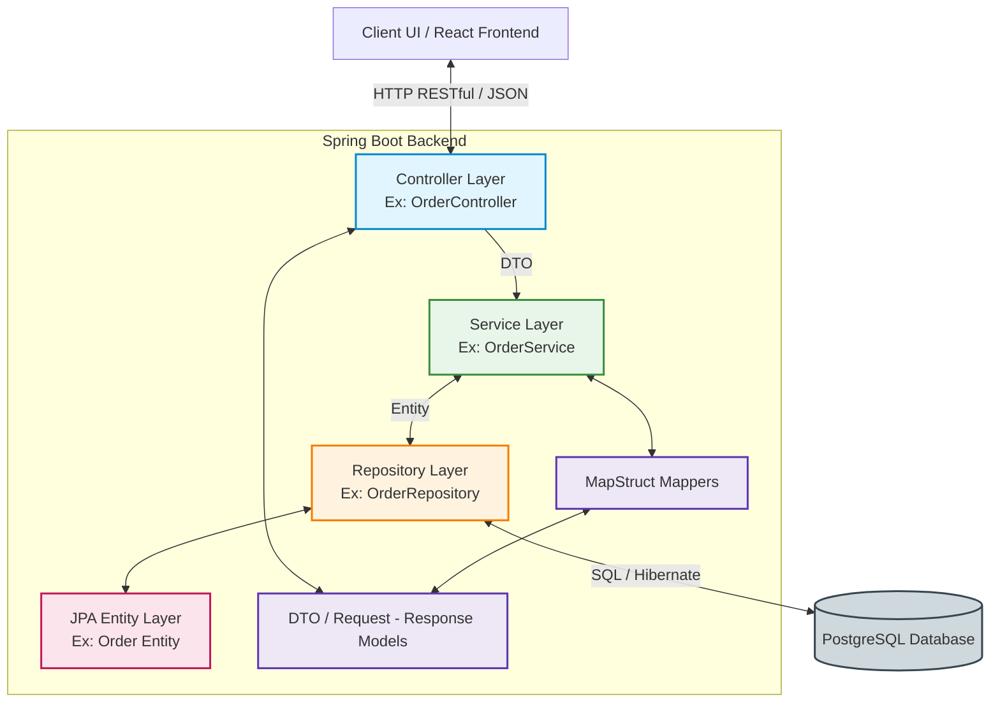
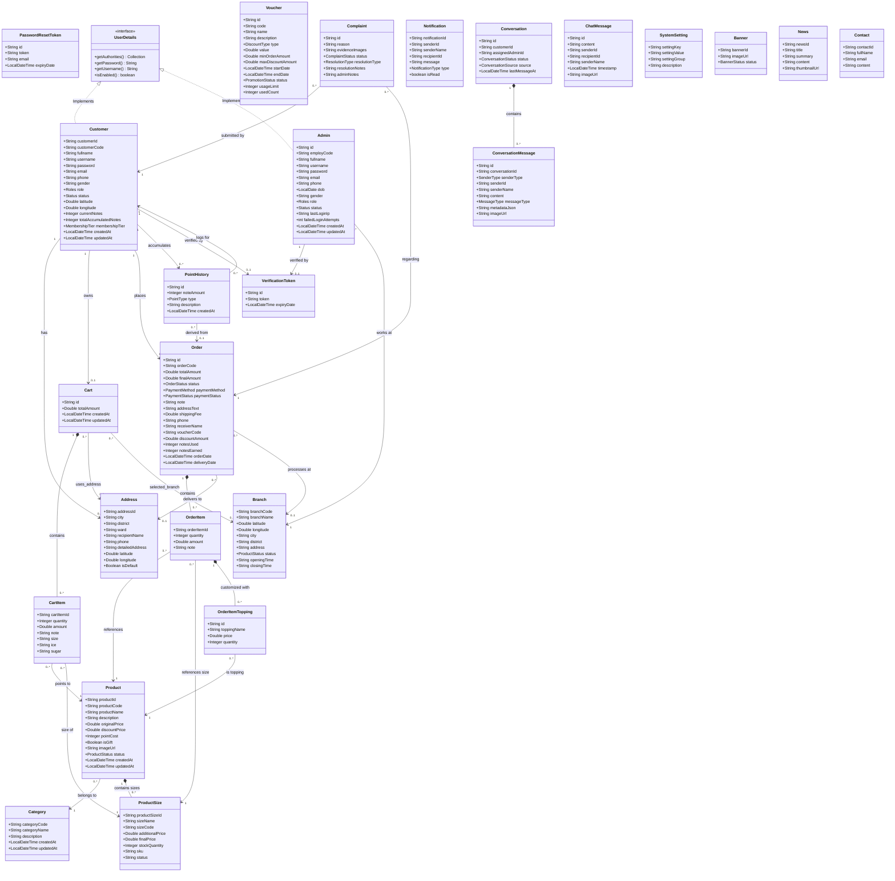
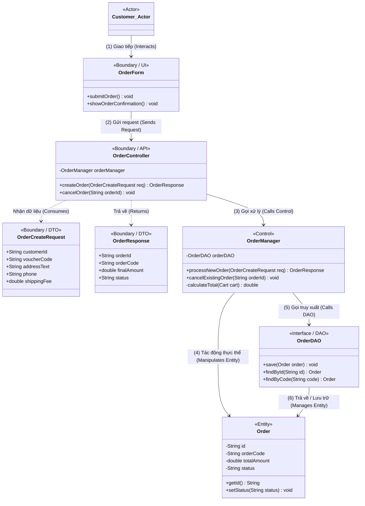
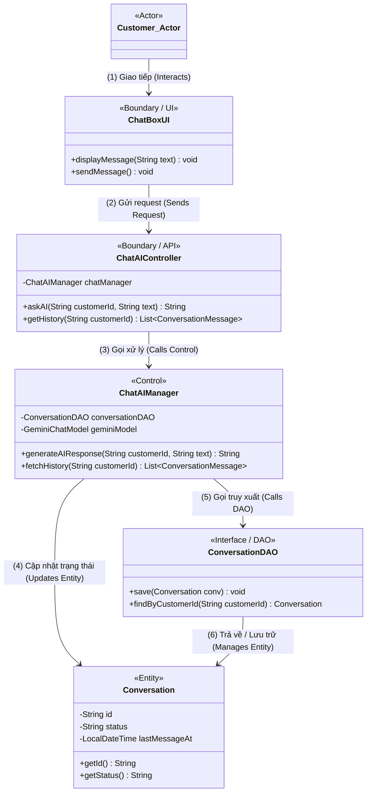
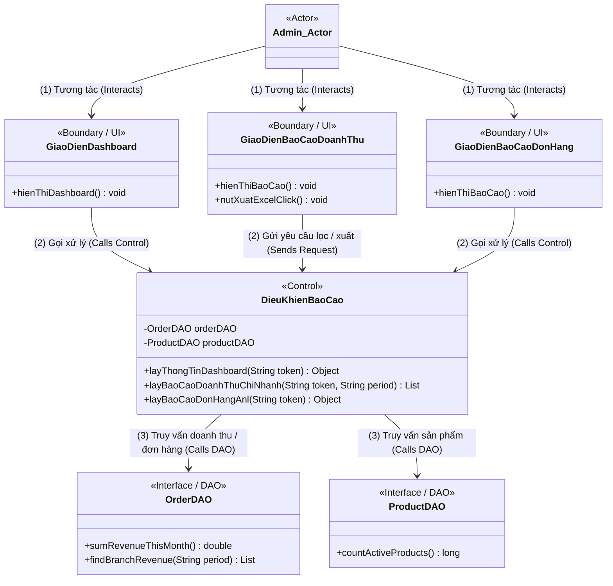
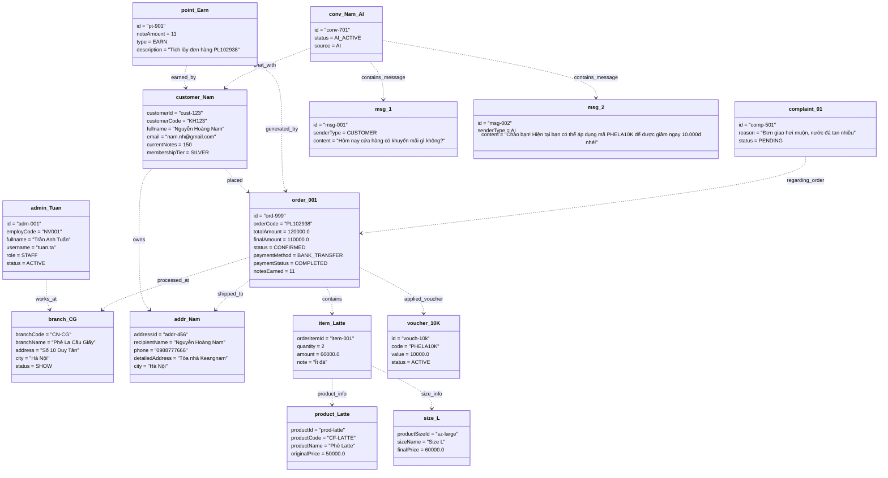
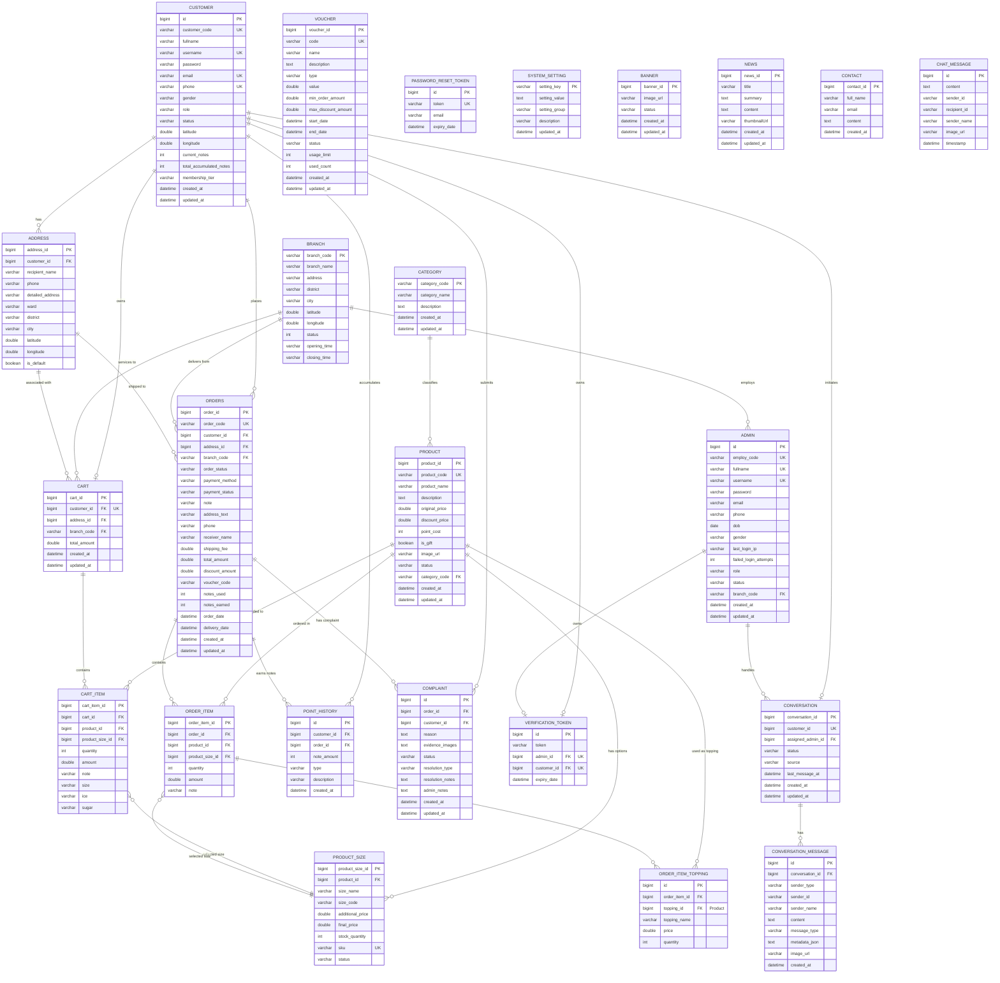

# Biểu đồ Lớp (Class Diagram) & Thực thể Dữ liệu (ORM / ERD) - Hệ thống PheLaWeb

Tài liệu này tổng hợp toàn bộ phân tích về kiến trúc mã nguồn của hệ thống **PheLaWeb**, bao gồm biểu đồ lớp và bản đồ thực thể cơ sở dữ liệu.

> [!NOTE]
> **Lưu ý về thuật ngữ ODM và ORM:**
> Dự án PheLaWeb sử dụng cơ sở dữ liệu quan hệ **PostgreSQL** kết hợp với **Spring Data JPA (Hibernate)**. Do đó, hệ thống sử dụng mô hình **ORM (Object-Relational Mapping)** để ánh xạ các class Java sang các bảng cơ sở dữ liệu quan hệ, thay vì **ODM (Object-Document Mapping)** vốn dành cho cơ sở dữ liệu dạng tài liệu (NoSQL) như MongoDB. Bản vẽ dưới đây sẽ thể hiện biểu đồ thực thể quan hệ JPA (JPA ORM / ERD) của hệ thống.

---

## 1. Kiến trúc Tổng quan Hệ thống (Layered Architecture)

Hệ thống PheLaWeb được xây dựng theo kiến trúc phân tầng tiêu chuẩn (Layered Architecture) của Spring Boot:

---

## 2. Biểu đồ Lớp (Class Diagram)

Tài liệu thiết kế lớp được chia làm hai mức độ: **Mức Khái niệm (Domain Class Diagram)** biểu diễn cấu trúc dữ liệu thực thể tổng quan, và **Mức Thiết kế (Design Class Diagram)** biểu diễn chi tiết triển khai phần mềm (các lớp Controller, Service, Repository, DTO).

### 2.1. Biểu đồ lớp khái niệm (Domain Class Diagram - Overview)

Dưới đây là **Biểu đồ lớp khái niệm của toàn bộ hệ thống** bao quát cả 26 lớp thực thể và mối quan hệ giữa chúng, được chia thành các phân hệ nghiệp vụ chính:

### 2.2. Biểu đồ lớp mức thiết kế (Design Class Diagram - BCE Pattern)

Biểu đồ lớp mức thiết kế áp dụng mô hình **Boundary - Control - Entity (BCE)** kết hợp với mẫu **DAO (Data Access Object)** để mô tả cấu trúc tĩnh và luồng đi của dữ liệu.

Để thể hiện rõ ràng và trực quan nhất mối quan hệ giữa các lớp theo đúng mô hình BCE + DAO, tài liệu chia thành hai sơ đồ thiết kế chi tiết cho hai luồng nghiệp vụ cốt lõi: **Đặt hàng (Place Order)** và **Tư vấn AI Chatbot (AI Chat)**. Các đường liên kết được đánh số thứ tự từ **(1)** đến **(6)** biểu diễn luồng điều khiển và luồng dữ liệu chạy qua các lớp.

---

#### 2.2.1. Phân hệ Đặt hàng (Ordering Use Case - Design Class Diagram)

*   **Tác nhân**: `Customer_Actor` (Khách hàng).
*   **Lớp biên (Boundary)**: 
    *   `OrderForm` (UI phía Client nhận thao tác bấm nút đặt hàng).
    *   `OrderController` (API nhận dữ liệu yêu cầu tạo đơn).
    *   `OrderCreateRequest` & `OrderResponse` (Các DTO truyền tải thông tin).
*   **Lớp điều khiển (Control)**: `OrderManager` (Chứa nghiệp vụ kiểm tra kho, tính tiền, áp voucher).
*   **Lớp truy xuất dữ liệu (DAO)**: `OrderDAO` (Thực hiện lưu đơn vào CSDL).
*   **Lớp thực thể (Entity)**: `Order` (Đối tượng đơn hàng lưu giữ thông tin trạng thái).

---

#### 2.2.2. Phân hệ Tư vấn AI (AI Chatbot Use Case - Design Class Diagram)

*   **Tác nhân**: `Customer_Actor` (Khách hàng).
*   **Lớp biên (Boundary)**: 
    *   `ChatBoxUI` (Giao diện khung chat nhận tin nhắn gõ từ khách hàng).
    *   `ChatAIController` (API Controller nhận tin nhắn từ client và chuyển tiếp).
*   **Lớp điều khiển (Control)**: `ChatAIManager` (Chịu trách nhiệm gọi API AI Gemini để sinh câu trả lời).
*   **Lớp truy xuất dữ liệu (DAO)**: `ConversationDAO` (Tìm kiếm và lưu trữ lịch sử cuộc hội thoại).
*   **Lớp thực thể (Entity)**: `Conversation` (Lớp lưu trữ thông tin phòng chat giữa khách hàng và AI).

---

#### 2.2.3. Phân hệ Báo cáo & Dashboard (Dashboard & Reports Use Case - Design Class Diagram)

*   **Tác nhân**: `Admin_Actor` (Quản trị viên / Nhân viên).
*   **Lớp biên (Boundary)**:
    *   `GiaoDienDashboard` (Xem thông tin KPIs tóm tắt và danh sách đơn mới nhất).
    *   `GiaoDienBaoCaoDoanhThu` (Xem báo cáo doanh thu của các chi nhánh theo chu kỳ thời gian).
    *   `GiaoDienBaoCaoDonHang` (Xem phân bổ trạng thái đơn hàng và thống kê danh mục sản phẩm).
*   **Lớp điều khiển (Control)**: `DieuKhienBaoCao` (Chịu trách nhiệm truy vấn tổng hợp từ các bảng và thực hiện logic phân quyền chi nhánh).
*   **Lớp truy xuất dữ liệu (DAO)**:
    *   `OrderDAO`, `ProductDAO`, `CustomerDAO`, `BranchDAO`, `AdminDAO`.
*   **Lớp thực thể (Entity)**:
    *   `Order`, `Product`, `Customer`, `Branch`, `Admin`.

---

## 3. Biểu đồ Đối tượng Tổng quan (System Object Diagram - ODM)

Trong phân tích thiết kế hướng đối tượng (OOAD), **Biểu đồ Đối tượng (Object Diagram - ODM)** đóng vai trò chụp lại trạng thái runtime cụ thể của hệ thống tại một thời điểm xác định. Dưới đây là biểu đồ đối tượng tổng quan bao quát toàn bộ các nghiệp vụ lớn của hệ thống PheLaWeb: **Đặt hàng, Chăm sóc khách hàng bằng AI, Tích điểm thành viên và Quản lý cửa hàng/sản phẩm**:

---

## 4. Biểu đồ Cơ sở Dữ liệu Quan hệ (Entity-Relationship Diagram - ERD/ERM)

Biểu đồ dưới đây biểu diễn **Mô hình Quan hệ Thực thể (ERD/ERM)** của cơ sở dữ liệu hệ thống PheLaWeb. Cấu trúc các bảng, khóa chính (PK) tự tăng kiểu `bigint`, các khóa ngoại (FK) và kiểu dữ liệu được thiết kế đồng bộ 100% với file cơ sở dữ liệu quan hệ [database_final.sql](file:///d:/KyVI_HocVienNganHang/TTCN/PheLaWeb/database_final.sql):

